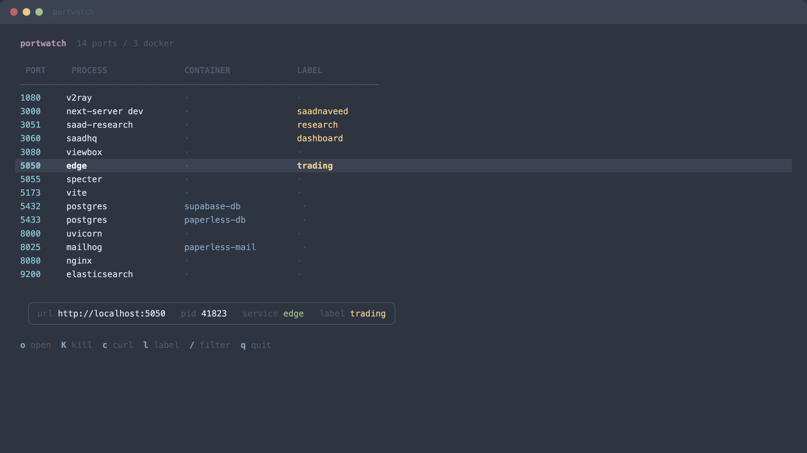

# portwatch

Live-updating TUI that shows every service listening on your local ports. Like `lsof -iTCP -sTCP:LISTEN` but beautiful and always-on.



## Why

Every developer has hit "port already in use" and then fumbled through `lsof` flags to figure out what's hogging it. portwatch keeps a live dashboard of everything listening — process names, Docker containers, serviceman services — so you always know what's running and can kill it in one keystroke.

## Install

```bash
go install github.com/saadnvd1/portwatch@latest
```

Or build from source:

```bash
git clone https://github.com/saadnvd1/portwatch.git
cd portwatch
go build -o portwatch .
```

## Usage

```bash
portwatch            # live-updating TUI
portwatch list       # one-shot list (scriptable)
```

## Features

- **Live-updating** — auto-refreshes every 2s, no manual re-running
- **Smart process names** — resolves node/python scripts to actual filenames, not just `node`
- **Docker-aware** — maps ports to container names
- **serviceman integration** — detects services managed by serviceman (including child processes)
- **Bookmarks** — label ports with persistent names across sessions
- **Filter** — type `/` to search by port, process, container, or label
- **Quick actions** — open in browser, kill process, copy curl command

## Keybindings

| Key | Action |
|-----|--------|
| `j/k` or `arrows` | navigate |
| `o` | open in browser |
| `K` | kill process |
| `c` | copy curl command |
| `l` | label/bookmark port |
| `/` | filter |
| `g/G` | top/bottom |
| `q` | quit |

## How it works

Single-binary Go app. Scans ports via `lsof`, resolves process names via `ps`, enriches with Docker and serviceman metadata. Labels persist to `~/.config/portwatch/labels.json`. UI built with [bubbletea](https://github.com/charmbracelet/bubbletea).

## Related

- [serviceman](https://github.com/saadnvd1/serviceman) — lightweight process manager with auto-restart and logging. portwatch auto-detects serviceman-managed services and shows them by name.

## License

MIT
